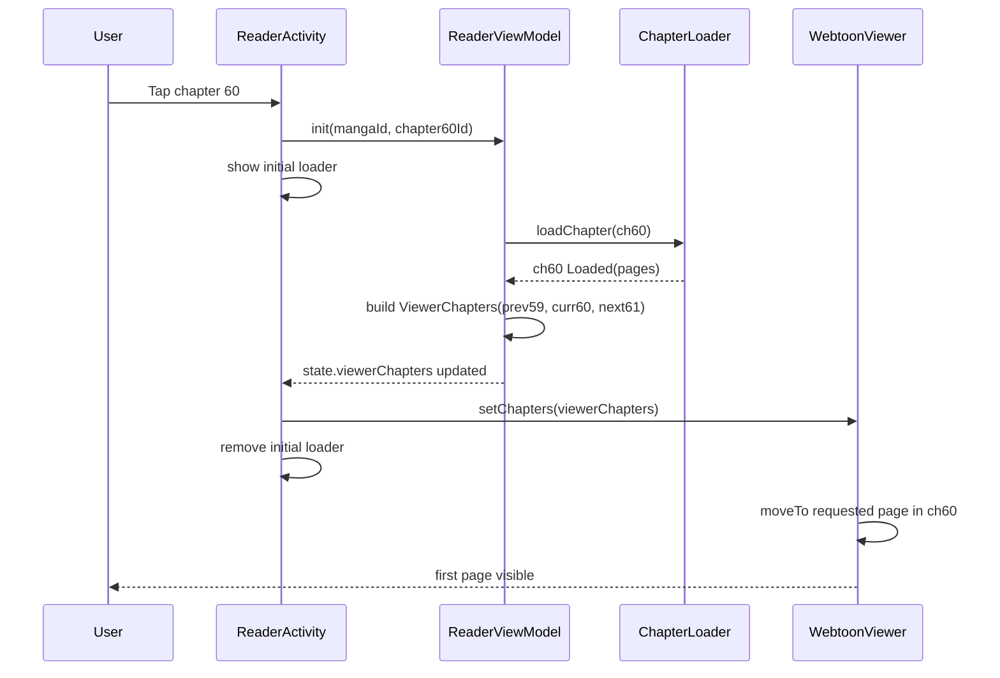
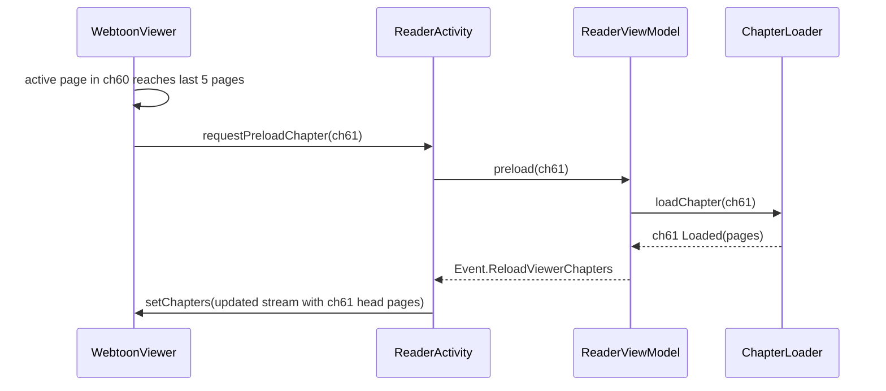
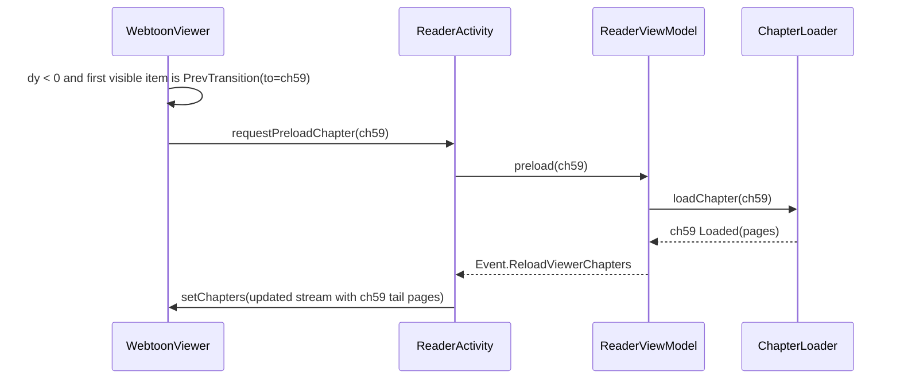
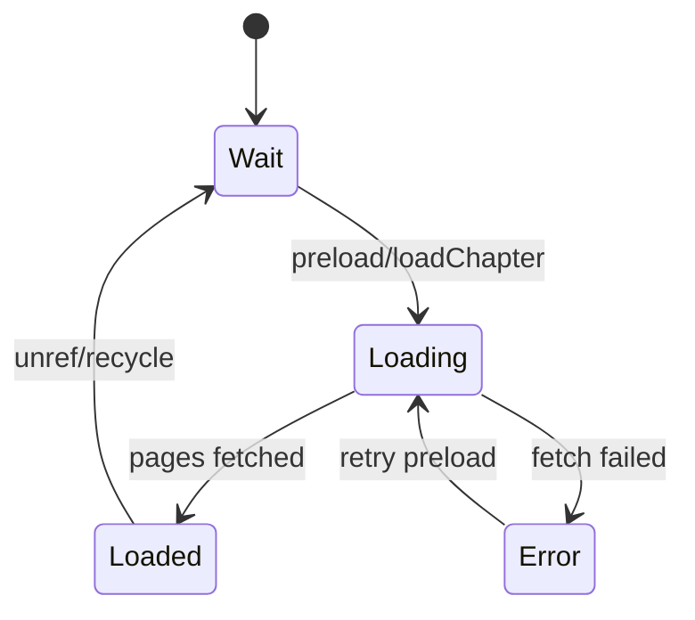
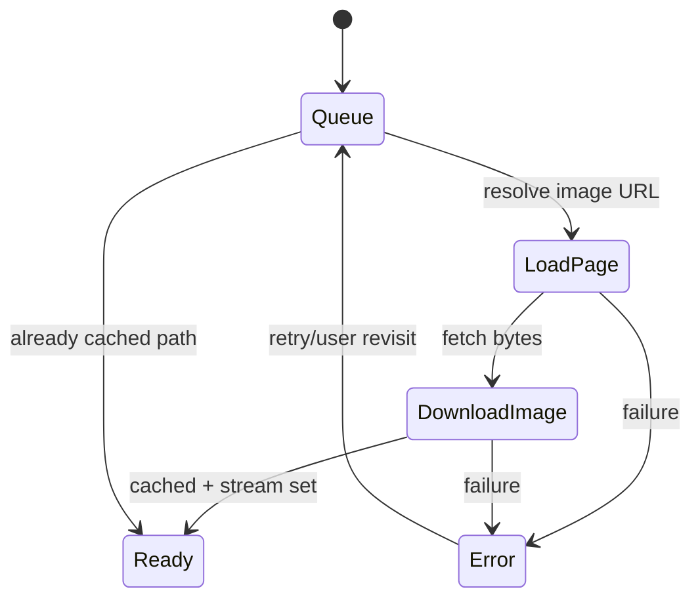

# Mihon Webtoon ("Webtoon Weaver") Dataflow and Preload Architecture

This document explains the Webtoon reader in Mihon from a **data/state** perspective, focused on:
1. Initial load UX (black screen + loader -> reader)
2. Per-page loading behavior
3. Cross-chapter preloading (prev/next) for seamless scrolling

It intentionally avoids adapter/framework internals except where needed to explain data flow.

## 1) Runtime pipeline from chapter click to first rendered page

### 1.1 Entry and initial loading layer
- `ReaderActivity` is launched with `mangaId` + `chapterId`.
- `ReaderViewModel.init()` creates a `ChapterLoader`, loads the target chapter, and builds `ViewerChapters(curr, prev, next)`.
- Before chapter items are pushed to the viewer, activity adds a centered `ReaderProgressIndicator` on `reader_container`.
- Reader background color is usually black (depends on reader theme setting; default path resolves to black).

Relevant:
- `mihon/app/src/main/java/eu/kanade/tachiyomi/ui/reader/ReaderActivity.kt:545`
- `mihon/app/src/main/java/eu/kanade/tachiyomi/ui/reader/ReaderActivity.kt:600`
- `mihon/app/src/main/java/eu/kanade/tachiyomi/ui/reader/ReaderViewModel.kt:286`
- `mihon/app/src/main/java/eu/kanade/tachiyomi/ui/reader/ReaderViewModel.kt:319`
- `mihon/app/src/main/java/eu/kanade/tachiyomi/ui/reader/ReaderActivity.kt:844`

### 1.2 First chapter page list fetch
- `ChapterLoader.loadChapter(chapter)` sets `chapter.state = Loading`.
- It chooses concrete page loader (download/local/http).
- `getPages()` returns page descriptors; chapter state becomes `Loaded(pages)`.
- ViewModel then sets `ViewerChapters(curr, prev, next)`.

Relevant:
- `mihon/app/src/main/java/eu/kanade/tachiyomi/ui/reader/loader/ChapterLoader.kt:35`
- `mihon/app/src/main/java/eu/kanade/tachiyomi/ui/reader/model/ReaderChapter.kt:45`

### 1.3 Viewer activation and first visible page
- Webtoon recycler is initially hidden (`isVisible = false`).
- On first `setChapters`, it computes item list, scrolls to requested page, then shows recycler.
- Activity removes initial loader overlay once chapters are set.

Relevant:
- `mihon/app/src/main/java/eu/kanade/tachiyomi/ui/reader/viewer/webtoon/WebtoonViewer.kt:83`
- `mihon/app/src/main/java/eu/kanade/tachiyomi/ui/reader/viewer/webtoon/WebtoonViewer.kt:242`
- `mihon/app/src/main/java/eu/kanade/tachiyomi/ui/reader/ReaderActivity.kt:600`

## 2) Core data structures (state-centric)

```text
ReaderState
  manga
  viewerChapters: ViewerChapters?
  currentChapter
  currentPage
  isLoadingAdjacentChapter
  ...

ViewerChapters
  currChapter: ReaderChapter
  prevChapter: ReaderChapter?
  nextChapter: ReaderChapter?

ReaderChapter
  chapter (db model)
  stateFlow: Wait | Loading | Error | Loaded(pages)
  pageLoader
  requestedPage

ReaderPage (extends Page)
  index, number
  chapter (backref)
  statusFlow: Queue | LoadPage | DownloadImage | Ready | Error
  progressFlow: 0..100
  stream(): InputStream

Item stream for webtoon list
  [prev-tail pages] + [PrevTransition?] + [curr pages] + [NextTransition?] + [next-head pages]
```

Relevant:
- `mihon/app/src/main/java/eu/kanade/tachiyomi/ui/reader/model/ViewerChapters.kt:3`
- `mihon/app/src/main/java/eu/kanade/tachiyomi/ui/reader/model/ReaderChapter.kt:9`
- `mihon/app/src/main/java/eu/kanade/tachiyomi/ui/reader/model/ReaderPage.kt:6`
- `mihon/source-api/src/commonMain/kotlin/eu/kanade/tachiyomi/source/model/Page.kt:11`
- `mihon/app/src/main/java/eu/kanade/tachiyomi/ui/reader/viewer/webtoon/WebtoonAdapter.kt:38`

## 3) Item-stream projection used for seamless chapter boundaries

When viewer receives `ViewerChapters`, it creates a linear item list:
- If previous chapter exists and has pages loaded: include `takeLast(2)` previous pages.
- Insert `ChapterTransition.Prev(...)` if needed.
- Insert all current chapter pages.
- Insert `ChapterTransition.Next(...)` if needed.
- If next chapter exists and loaded: include `take(2)` next pages.

Transition is kept when:
- `alwaysShowChapterTransition == true`, or
- there are missing chapters (chapter gap), or
- adjacent chapter is not yet loaded.

So seamless scrolling is achieved by **embedding neighbor chapter page slices** in the same scroll stream.

Relevant:
- `mihon/app/src/main/java/eu/kanade/tachiyomi/ui/reader/viewer/webtoon/WebtoonAdapter.kt:45`
- `mihon/app/src/main/java/eu/kanade/tachiyomi/ui/reader/viewer/webtoon/WebtoonAdapter.kt:51`
- `mihon/app/src/main/java/eu/kanade/tachiyomi/ui/reader/viewer/webtoon/WebtoonAdapter.kt:57`
- `mihon/app/src/main/java/eu/kanade/tachiyomi/ui/reader/viewer/webtoon/WebtoonAdapter.kt:70`
- `mihon/app/src/main/java/eu/kanade/tachiyomi/ui/reader/viewer/webtoon/WebtoonAdapter.kt:78`

## 4) Preloading: exact trigger moments and guards

## 4.1 Trigger A: nearing end of current chapter
When active page enters last 5 pages of current chapter:
- viewer requests preload for transition destination chapter (usually next chapter).
- guarded by `allowPreload` to avoid incorrect preloads while switching contexts.

Relevant:
- `mihon/app/src/main/java/eu/kanade/tachiyomi/ui/reader/viewer/webtoon/WebtoonViewer.kt:213`
- `mihon/app/src/main/java/eu/kanade/tachiyomi/ui/reader/viewer/webtoon/WebtoonViewer.kt:215`

## 4.2 Trigger B: transition element becomes active
When active item is `ChapterTransition`:
- preload destination chapter immediately.
- this is the brief boundary loader moment you described.

Relevant:
- `mihon/app/src/main/java/eu/kanade/tachiyomi/ui/reader/viewer/webtoon/WebtoonViewer.kt:230`

## 4.3 Trigger C: reverse scroll into top transition
When user scrolls upward (`dy < 0`) and first visible item is `ChapterTransition.Prev` with a destination chapter:
- preload previous chapter.

Relevant:
- `mihon/app/src/main/java/eu/kanade/tachiyomi/ui/reader/viewer/webtoon/WebtoonViewer.kt:98`

## 4.4 ViewModel preload executor
`ReaderViewModel.preload(chapter)` does:
- return if `Loaded` or already `Loading`.
- only proceed from `Wait`/`Error` states.
- `ChapterLoader.loadChapter(chapter)` (fetch page list + set loaded).
- emit `ReloadViewerChapters` so list recomposes with newly loaded adjacent pages.

Relevant:
- `mihon/app/src/main/java/eu/kanade/tachiyomi/ui/reader/ReaderViewModel.kt:400`
- `mihon/app/src/main/java/eu/kanade/tachiyomi/ui/reader/ReaderViewModel.kt:435`

## 4.5 Intra-chapter page prefetch (network pages)
Inside an HTTP chapter:
- loading one page also queues next 4 pages at lower priority.
- priority queue order: retry (2) > current requested page (1) > preload pages (0).

Relevant:
- `mihon/app/src/main/java/eu/kanade/tachiyomi/ui/reader/loader/HttpPageLoader.kt:44`
- `mihon/app/src/main/java/eu/kanade/tachiyomi/ui/reader/loader/HttpPageLoader.kt:99`
- `mihon/app/src/main/java/eu/kanade/tachiyomi/ui/reader/loader/HttpPageLoader.kt:148`
- `mihon/app/src/main/java/eu/kanade/tachiyomi/ui/reader/loader/HttpPageLoader.kt:199`

## 5) Why scrolling across chapters feels seamless

Seam is handled by two mechanisms:
1. **Projection seam:** item stream already includes small tail/head slices from neighbor chapters.
2. **Data seam:** transition and near-end triggers preload chapter metadata/page list before hard boundary.

When page from adjacent chapter is selected, ViewModel promotes that chapter to `currChapter` and rebuilds `ViewerChapters` centered on it, preserving scroll continuity.

Relevant:
- `mihon/app/src/main/java/eu/kanade/tachiyomi/ui/reader/ReaderViewModel.kt:463`
- `mihon/app/src/main/java/eu/kanade/tachiyomi/ui/reader/ReaderViewModel.kt:353`

## 6) Loader UX details (your observations mapped)

### 6.1 Full-screen initial loader
- Yes, present before first chapter projection is set.
- Center spinner over reader container (background often black).

### 6.2 Per-page loaders
- Conceptually there is one loader state per page (`Page.statusFlow`).
- Practically, because of RecyclerView virtualization, holders are created for visible/cached items, not all N simultaneously.
- Each page holder has a progress container with minimum height tied to parent height, preventing aggressive over-creation and preserving stable layout while image not decoded.

Relevant:
- `mihon/app/src/main/java/eu/kanade/tachiyomi/ui/reader/viewer/webtoon/WebtoonPageHolder.kt:55`
- `mihon/app/src/main/java/eu/kanade/tachiyomi/ui/reader/viewer/webtoon/WebtoonPageHolder.kt:265`

### 6.3 Width/edge-to-edge behavior
- Page container width is `MATCH_PARENT`; side padding is configurable percentage of screen width per side (`0..25`).
- Default side padding is `0`, so default is effectively edge-to-edge width.
- Image scaling mode for non-animated webtoon pages is `FIT_WIDTH`, which reinforces edge-to-edge rendering once loaded.

Relevant:
- `mihon/app/src/main/java/eu/kanade/tachiyomi/ui/reader/viewer/webtoon/WebtoonPageHolder.kt:102`
- `mihon/app/src/main/java/eu/kanade/tachiyomi/ui/reader/viewer/webtoon/WebtoonPageHolder.kt:107`
- `mihon/app/src/main/java/eu/kanade/tachiyomi/ui/reader/setting/ReaderPreferences.kt:66`
- `mihon/app/src/main/java/eu/kanade/tachiyomi/ui/reader/viewer/webtoon/WebtoonPageHolder.kt:204`

## 7) Moment diagrams

## 7.1 Open chapter 60


## 7.2 Scroll down near chapter end (preload 61)


## 7.3 Scroll up into previous boundary (preload 59)


## 7.4 Chapter/page state machines




## 8) React Native replication blueprint (data-first)

Use these entities:
- `chapterStore: Map<chapterId, ChapterNode>` where `ChapterNode.state = WAIT|LOADING|LOADED|ERROR` and `pages[]`.
- `readerWindow: { prevId?, currId, nextId? }`.
- `projectedItems: Array<PageItem | TransitionItem>` generated exactly like Mihon:
  - prev tail 2 -> prev transition? -> curr all -> next transition? -> next head 2.
- `activeItem` from scroll position.

Use these triggers:
- On active page in current chapter: if remaining < 5, preload next.
- On active transition: preload destination chapter.
- On upward scroll near top transition: preload previous chapter.

Use these guards:
- Skip preload if chapter already `LOADED` or `LOADING`.
- Emit a "reload projection" event after preload success.
- Change `currId` when active page.chapterId differs from current, then recenter window.

If you copy these constants, behavior will closely match Mihon:
- `prev tail pages = 2`
- `next head pages = 2`
- `near-end preload threshold = 5 pages`
- `intra-chapter network preload = next 4 pages`

## 9) Key takeaways

- The seamlessness is mostly from **projected mixed item stream + early adjacent chapter preloading**.
- Transition items are not cosmetic only; they are preload trigger points and status surfaces.
- The reader is built as two coupled state machines (chapter-level + page-level), with a projection layer converting chapter graph state into a single scroll list.
