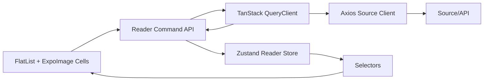
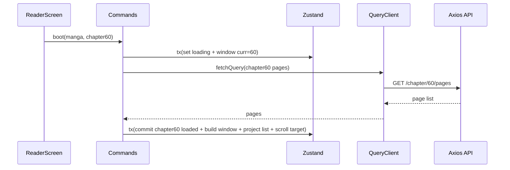
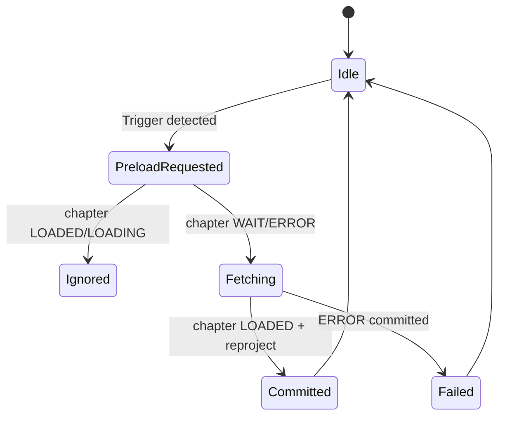

# React Native Webtoon Reader Architecture (Atomic, Mihon-Style)

This document specifies how to build a Mihon-like webtoon reader in **React Native + TypeScript** with:
- `expo-image`
- `axios`
- `@tanstack/react-query`
- `zustand`
- `React Context`

Primary goals:
1. Replicate Mihon's data behavior: chapter transitions, adjacent chapter preload, near-end preload, and mixed item stream.
2. Keep state updates **atomic** (single transaction per logical reader event).
3. Avoid side-effect-driven flow and minimize `useEffect` usage.
4. Prevent re-render storms and page jumps.

## 1. Non-negotiable invariants

1. Reader state is normalized (chapter/page entities + projected list ids).
2. All reader mutations go through command functions (no ad-hoc `setState` in components).
3. Each command commits in one store write (`set((s) => nextS)` once).
4. Rendering consumes stable selectors that return primitives or memoized arrays.
5. Network fetching does not directly mutate UI; fetch result is committed by explicit command.
6. Cross-chapter continuity is achieved by projecting:
- previous chapter tail pages (2)
- optional previous transition
- all current chapter pages
- optional next transition
- next chapter head pages (2)

## 2. Architecture overview



- `Context` provides `readerSessionId` and stable command references.
- `Zustand` stores session state and entity graph.
- `TanStack Query` caches chapter page lists and metadata.
- Commands orchestrate preload and commit atomically.

## 3. Type system and normalized entities

```ts
// ids
export type ChapterId = string;
export type PageId = string;
export type ItemId = string;

export type ChapterLoadState = 'WAIT' | 'LOADING' | 'LOADED' | 'ERROR';
export type PageLoadState = 'QUEUE' | 'LOAD_PAGE' | 'DOWNLOAD_IMAGE' | 'READY' | 'ERROR';

export interface ChapterMeta {
  id: ChapterId;
  indexInManga: number; // sorted read order index
  numberLabel: string;
  title: string;
  url: string;
}

export interface PageEntity {
  id: PageId;
  chapterId: ChapterId;
  index: number; // zero-based
  number: number; // index + 1
  pageUrl?: string;
  imageUrl?: string;
  status: PageLoadState;
  progress: number; // 0..100
  error?: string;
}

export interface ChapterEntity {
  id: ChapterId;
  meta: ChapterMeta;
  state: ChapterLoadState;
  pageIds: PageId[]; // populated when LOADED
  requestedPageIndex: number;
  error?: string;
}

export type TransitionDirection = 'PREV' | 'NEXT';

export interface TransitionItem {
  kind: 'transition';
  id: ItemId; // e.g. transition:PREV:curr:to
  fromChapterId: ChapterId;
  toChapterId?: ChapterId;
  direction: TransitionDirection;
}

export interface PageItem {
  kind: 'page';
  id: ItemId; // page:<pageId>
  pageId: PageId;
  chapterId: ChapterId;
}

export type ReaderItem = PageItem | TransitionItem;

export interface ReaderWindow {
  prevChapterId?: ChapterId;
  currChapterId: ChapterId;
  nextChapterId?: ChapterId;
}

export interface ActiveAnchor {
  itemId: ItemId;
  chapterId: ChapterId;
  pageIndex?: number;
}
```

## 4. Store shape (atomic slices)

Keep the store split into independent slices to reduce selector invalidation:

```ts
export interface ReaderSessionState {
  // static session config
  sessionId: string;
  mangaId: string;
  readerMode: 'WEBTOON';

  // entities
  chapters: Record<ChapterId, ChapterEntity>;
  pages: Record<PageId, PageEntity>;

  // chapter order graph
  chapterOrder: ChapterId[];
  chapterOrderIndex: Record<ChapterId, number>;

  // active window and projected list
  window: ReaderWindow;
  projectedItemIds: ItemId[];
  itemsById: Record<ItemId, ReaderItem>;

  // ui anchors
  activeAnchor?: ActiveAnchor;
  pendingScrollTarget?: { itemId: ItemId; offset: number };

  // preload bookkeeping
  preloading: Record<ChapterId, boolean>;
  lastPreloadReason?: 'NEAR_END' | 'TRANSITION_ACTIVE' | 'REVERSE_TOP';

  // settings influencing projection
  alwaysShowTransition: boolean;
  prevTailCount: number; // 2
  nextHeadCount: number; // 2
  nearEndThreshold: number; // 5
}
```

### Why this is atomic-friendly
- Entity maps (`chapters/pages`) are independent from projection (`projectedItemIds/itemsById`).
- A command can update all related slices in one pass.
- UI reads only narrow selectors (`activeAnchor`, `projectedItemIds`, per-item state).

## 5. Command-driven state machine

Use a command layer (pure transitions + effect orchestration):

```ts
export interface ReaderCommands {
  boot(params: BootParams): Promise<void>;
  onItemBecameActive(itemId: ItemId, scrollDir: 'UP' | 'DOWN' | 'NONE'): void;
  onPageImageEvent(input: PageImageEvent): void;
  preloadChapter(chapterId: ChapterId, reason: PreloadReason): Promise<void>;
  promoteChapterIfNeeded(chapterId: ChapterId): void;
}
```

Rules:
1. Compute next state synchronously.
2. Commit once.
3. Kick async fetch only when needed.
4. On fetch resolve, commit one final transaction.

## 6. Boot flow (chapter 60 open)



Boot does not rely on component `useEffect` loops. The screen explicitly calls `boot` once from navigation lifecycle.

## 7. Projection algorithm (Mihon-equivalent)

```ts
export function projectItems(s: ReaderSessionState): {
  projectedItemIds: ItemId[];
  itemsById: Record<ItemId, ReaderItem>;
} {
  const outIds: ItemId[] = [];
  const outMap: Record<ItemId, ReaderItem> = {};

  const { prevChapterId, currChapterId, nextChapterId } = s.window;
  const prev = prevChapterId ? s.chapters[prevChapterId] : undefined;
  const curr = s.chapters[currChapterId];
  const next = nextChapterId ? s.chapters[nextChapterId] : undefined;

  if (prev?.state === 'LOADED') {
    const tail = prev.pageIds.slice(-s.prevTailCount);
    for (const pid of tail) addPage(pid, prev.id);
  }

  const showPrevTransition =
    s.alwaysShowTransition || !prev || prev.state !== 'LOADED' || hasMissingGap(prev, curr);
  if (showPrevTransition) {
    addTransition('PREV', curr.id, prev?.id);
  }

  if (curr.state === 'LOADED') {
    for (const pid of curr.pageIds) addPage(pid, curr.id);
  }

  const showNextTransition =
    s.alwaysShowTransition || !next || next.state !== 'LOADED' || hasMissingGap(curr, next);
  if (showNextTransition) {
    addTransition('NEXT', curr.id, next?.id);
  }

  if (next?.state === 'LOADED') {
    const head = next.pageIds.slice(0, s.nextHeadCount);
    for (const pid of head) addPage(pid, next.id);
  }

  return { projectedItemIds: outIds, itemsById: outMap };

  function addPage(pageId: PageId, chapterId: ChapterId) {
    const id = `page:${pageId}`;
    const item: PageItem = { kind: 'page', id, pageId, chapterId };
    outIds.push(id);
    outMap[id] = item;
  }

  function addTransition(direction: TransitionDirection, fromChapterId: ChapterId, toChapterId?: ChapterId) {
    const id = `transition:${direction}:${fromChapterId}:${toChapterId ?? 'none'}`;
    const item: TransitionItem = { kind: 'transition', id, direction, fromChapterId, toChapterId };
    outIds.push(id);
    outMap[id] = item;
  }
}
```

Important: build projection in the **same transaction** as chapter load completion or chapter promotion.

## 8. Preload trigger model

Replicate Mihon with three triggers:

1. `NEAR_END`: active page is in current chapter and remaining pages `< nearEndThreshold`.
2. `TRANSITION_ACTIVE`: active item is transition and `toChapterId` exists.
3. `REVERSE_TOP`: user scrolls up and first visible item is `PREV transition` with destination.



## 9. Query strategy (TanStack Query)

### Query keys
```ts
['reader', 'chapterPages', sourceId, chapterId]
```

### Fetchers
- `axios` returns stable DTOs.
- Transform DTO -> normalized `PageEntity[]` in command layer, not component.

### Use query client imperatively
Prefer `queryClient.fetchQuery` / `ensureQueryData` in commands.
Avoid many per-cell `useQuery` hooks.

```ts
async function fetchChapterPages(queryClient: QueryClient, sourceId: string, chapterId: ChapterId) {
  return queryClient.fetchQuery({
    queryKey: ['reader', 'chapterPages', sourceId, chapterId],
    queryFn: () => api.getChapterPages(sourceId, chapterId),
    staleTime: 1000 * 60 * 10,
    gcTime: 1000 * 60 * 60,
  });
}
```

## 10. Atomic transaction patterns

## 10.1 Chapter preload commit

```ts
const commitChapterLoaded = (chapterId: ChapterId, pages: ApiPageDto[]) =>
  set((s) => {
    const chapter = s.chapters[chapterId];
    if (!chapter) return s;

    const nextPages = { ...s.pages };
    const pageIds: PageId[] = [];

    for (let i = 0; i < pages.length; i++) {
      const p = pages[i];
      const pageId = `${chapterId}:${i}`;
      pageIds.push(pageId);
      nextPages[pageId] = {
        id: pageId,
        chapterId,
        index: i,
        number: i + 1,
        pageUrl: p.pageUrl,
        imageUrl: p.imageUrl,
        status: 'QUEUE',
        progress: 0,
      };
    }

    const nextChapters = {
      ...s.chapters,
      [chapterId]: {
        ...chapter,
        state: 'LOADED',
        pageIds,
        error: undefined,
      },
    };

    const draft = {
      ...s,
      chapters: nextChapters,
      pages: nextPages,
      preloading: { ...s.preloading, [chapterId]: false },
    };

    const projection = projectItems(draft);
    return {
      ...draft,
      projectedItemIds: projection.projectedItemIds,
      itemsById: projection.itemsById,
    };
  });
```

Single `set` means no intermediate UI state where items and entities disagree.

## 10.2 Active item handling

`onItemBecameActive` should do one transaction:
1. update `activeAnchor`
2. maybe promote chapter (`window.curr` change)
3. maybe set `pending preload intent` metadata
4. maybe set `pendingScrollTarget` (if needed)

Then schedule preload call (async) from command function, not from component effect.

## 11. Scroll integration (FlatList)

Use `onViewableItemsChanged` as source-of-truth for active item.

- Derive active item deterministically:
- prefer last fully visible item (Mihon-like bottom-edge active logic)
- fallback to highest visible index

Do not compute active item in multiple hooks.

```ts
const onViewableItemsChanged = useRef(({ viewableItems, changed }) => {
  const active = pickActiveItem(viewableItems); // pure function
  if (!active) return;
  commands.onItemBecameActive(active.itemId, detectScrollDir(changed));
}).current;
```

## 12. Page loading states with expo-image

`expo-image` events map to page status updates:
- `onLoadStart` -> `LOAD_PAGE`
- `onProgress` -> `DOWNLOAD_IMAGE` + progress
- `onLoad` -> `READY`
- `onError` -> `ERROR`

Each event dispatches targeted command:

```ts
commands.onPageImageEvent({ pageId, type: 'progress', value: 42 });
```

This updates only that page entity atomically; cell selector should subscribe only to that page fields.

## 13. Component boundaries and memoization

## 13.1 ReaderScreen
Responsibilities:
- create/obtain session
- call `boot`
- render `FlatList` with `projectedItemIds`

Should subscribe only to:
- `projectedItemIds`
- `pendingScrollTarget`

## 13.2 ReaderItemRenderer
- Receives `itemId` only.
- Uses selector to resolve item shape.
- `React.memo` with shallow compare.

## 13.3 PageCell
Subscribe only to specific page fields:
- `imageUrl`, `status`, `progress`, `error`

```ts
const selector = useCallback((s: RootState) => {
  const pid = pageId;
  const p = s.reader.sessions[sessionId].pages[pid];
  return p ? [p.imageUrl, p.status, p.progress, p.error] as const : undefined;
}, [sessionId, pageId]);
```

Avoid selecting large objects.

## 14. Context + Zustand wiring

Use context for stable session and commands:

```ts
interface ReaderRuntime {
  sessionId: string;
  commands: ReaderCommands;
}

const ReaderRuntimeContext = createContext<ReaderRuntime | null>(null);
```

This avoids prop-drilling and avoids global store collisions when multiple readers exist.

## 15. Minimizing useEffect

Allowed effects:
1. Boot on screen enter (one effect).
2. Apply `pendingScrollTarget` to FlatList ref (one effect).
3. Optional cleanup on unmount.

Everything else should be event/command driven:
- scroll callbacks
- image callbacks
- explicit button actions

Avoid effect chains like:
- "if state A changes, fetch B in useEffect, then update C in useEffect".

## 16. Page jump prevention checklist

1. Projection + entity commit in same transaction.
2. Stable `keyExtractor` by `itemId`.
3. Deterministic `getItemLayout` where possible (or anchor-preserving scroll correction).
4. Do not replace `projectedItemIds` unless logically changed.
5. Promote chapter only when active page belongs to another chapter.
6. Maintain `requestedPageIndex` per chapter.

## 17. Suggested file/module layout

```text
src/features/reader/
  domain/
    reader.types.ts
    reader.projection.ts
    reader.guards.ts
    reader.commands.ts
  infra/
    reader.api.ts          // axios
    reader.query.ts        // tanstack keys/fetchers
  state/
    reader.store.ts        // zustand root
    reader.session.slice.ts
    reader.selectors.ts
  ui/
    ReaderProvider.tsx     // context runtime
    ReaderScreen.tsx
    ReaderList.tsx
    cells/
      PageCell.tsx
      TransitionCell.tsx
```

## 18. Concrete command pseudocode

## 18.1 `preloadChapter`

```ts
async function preloadChapter(chapterId: ChapterId, reason: PreloadReason) {
  const s = getSession();
  const chapter = s.chapters[chapterId];
  if (!chapter) return;
  if (chapter.state === 'LOADED' || chapter.state === 'LOADING') return;

  set((st) => markChapterLoading(st, s.sessionId, chapterId, reason));

  try {
    const pages = await fetchChapterPages(queryClient, s.sourceId, chapterId);
    set((st) => commitChapterLoadedTx(st, s.sessionId, chapterId, pages));
  } catch (e) {
    set((st) => commitChapterErrorTx(st, s.sessionId, chapterId, toMessage(e)));
  }
}
```

## 18.2 `onItemBecameActive`

```ts
function onItemBecameActive(itemId: ItemId, dir: ScrollDir) {
  const intent = deriveIntent(getSession(), itemId, dir); // pure

  set((st) => commitActiveIntentTx(st, sessionId, intent));

  if (intent.preloadChapterId) {
    void preloadChapter(intent.preloadChapterId, intent.preloadReason);
  }
}
```

## 19. Performance knobs

- `FlatList`:
- `windowSize` tuned for long strips
- `maxToRenderPerBatch` moderate
- `removeClippedSubviews` true (test per device)

- Image:
- prefer `cachePolicy` matching source characteristics
- avoid decoding huge images on JS thread

- Store:
- use `subscribeWithSelector`
- custom equality fns for tuple selectors

- Query:
- long `staleTime` for chapter pages in active session
- prefetch next chapter proactively via command

## 20. Testing strategy

## 20.1 Pure function tests
- `projectItems`
- preload trigger derivation
- chapter promotion logic
- transaction reducers

## 20.2 Integration tests
- Open chapter 60 -> projected list contains expected order.
- Scroll near end -> next chapter preload called once.
- Scroll upward to prev transition -> prev preload called.
- After preload, projection includes prev tail/next head pages.

## 20.3 Regression tests for jumps
- Snapshot anchor before commit and after commit.
- Ensure first visible item remains stable unless intentional transition.

## 21. Implementation milestones

1. Build normalized types + projection function + tests.
2. Build session store + command layer (no UI yet).
3. Integrate axios + query client through command API.
4. Render FlatList with `projectedItemIds` and transition/page cells.
5. Add preload triggers and chapter promotion.
6. Tune memoization and profile re-renders.

## 22. Final mapping to Mihon behavior

This design preserves Mihon's core behaviors:
- Initial chapter fetch before first meaningful render.
- Per-page loader states.
- Transition-based adjacent chapter preload.
- Near-end next preload.
- Reverse-scroll previous preload.
- Mixed list projection with neighbor page slices for smooth boundary crossing.

It does so with React Native constraints while keeping all critical reader changes **atomic, deterministic, and command-driven**.

## 23. UI parity spec (strict 1:1 notes)

This section clarifies exact Mihon parity for the two points you asked.

### 23.1 Click chapter -> fetch chapter data first -> then render reader

Yes, this architecture explicitly does that:
- `boot()` fetches initial chapter page list first.
- only after success do we atomically commit:
  - chapter state `LOADED`
  - `window`
  - projected items
  - initial scroll target
- reader list becomes visible after that commit.

This matches Mihon behavior where initial reader loader is shown before chapter pages are set.

### 23.2 Placeholder/loader dimensions and image placement parity

Important correction: Mihon is not exactly \"80-90% page-height placeholders\".

Mihon behavior is closer to:
- each loading page holder has a progress container sized to **parent viewport height** (`parentHeight`), used as minimum visual block while loading.
- error layout uses about `80%` of parent height.
- page frame is `MATCH_PARENT` width + `WRAP_CONTENT` height.
- side paddings are % of screen width (`0..25`, default `0`).
- image scale mode for webtoon non-animated pages is `FIT_WIDTH`.

So for one-to-one RN parity, implement:
- loader placeholder min-height = viewport height (not 80-90%).
- optional error placeholder height = `0.8 * viewportHeight`.
- page container width = full width minus side padding.
- render image at full available width using known aspect ratio (`height = width / aspectRatio`) once metadata is known.
- keep top anchoring for page flow; do not recenter vertically at page level.

### 23.3 RN implementation addendum for UI parity

Use this in `PageCell`:
- while `status !== READY`: show placeholder block with `minHeight: viewportHeight` and centered spinner.
- when `READY`: swap to image container with computed height and `contentFit=\"cover\"` or `contentFit=\"fill\"` only if you already computed exact box ratio; otherwise use `contentFit=\"contain\"` with explicit box height.
- preserve stable keys and avoid remounting parent rows, so scroll anchor does not jump.

This gives closest practical parity to Mihon's loading-to-image transition behavior.
